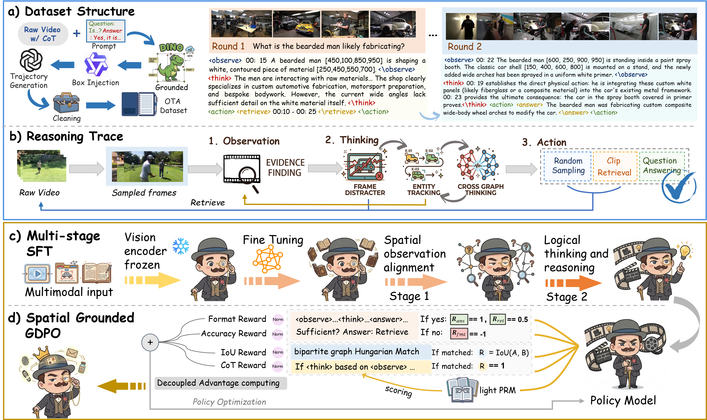

## 🕵️‍♂️ POIROT: Proactive Observation and Interleaved Reasoning On Traces for Video Agents

[](https://opensource.org/licenses/MIT)
[](https://huggingface.co/datasets/YOUR_ORG/POIROT_OTA_Dataset) 
[](#)

We introduce a novel hierarchical reasoning architecture designed to significantly improve how Multimodal Large Language Models (MLLMs) perform multi-step, spatio-temporal reasoning in complex videos.

<p align="center">
  
  <br>
  <em>Figure 1: The Observe-Think-Action workflow and diagram of POIROT.</em>
</p>

## 🌟 Key Features

* **Visualized Chain-of-Thought (V-CoT):** Shifts the paradigm from coarse frame-level perception to explicit object-level investigation. By outputting pure coordinate traces (`<box>[x1, y1, x2, y2]</box>`), the model effectively filters out visual noise and anchors its logic to physical reality.
* **Observe-Think-Action (O-T-A) Workflow:** An autonomous loop that empowers the agent to proactively track entities across frames, deduce spatio-temporal causal associations, and retrieve new frames when evidentiary gaps exist.
* **SG-GDPO Reinforcement Learning:** A state-of-the-art multi-dimensional RL framework featuring:
  **1) Hungarian Matching** A dense spatial reward (mIoU) utilizing bipartite graph matching to strictly penalize grounding hallucinations.
  **2) Lightweight PRM** Asynchronous RPC calls to a smaller LLM (e.g., Qwen2.5-1.5B) to verify cross-graph logical consistency and suppress causal confusion.

---

## 📢 News
* **[2026-04-04]** 🚀 Training scripts, evaluation code, and the OTA Dataset have been fully open-sourced.

---

## 🛠️ Installation

```bash
# Clone the repository
git clone [https://github.com/YOUR_GITHUB_USERNAME/POIROT.git](https://github.com/YOUR_GITHUB_USERNAME/POIROT.git)
cd POIROT

# Create a conda environment
conda create -n poirot python=3.10 -y
conda activate poirot

# Install dependencies (requires MS-Swift, vLLM, and standard ML libraries)
pip install ms-swift vllm scipy numpy transformers
